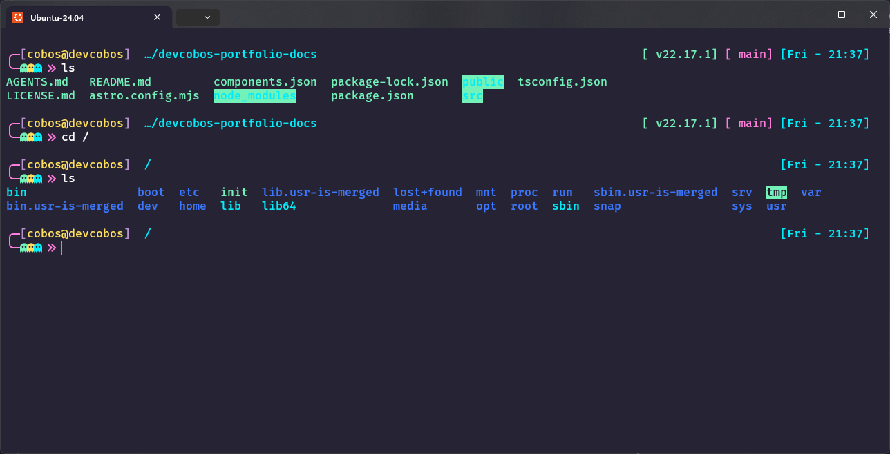
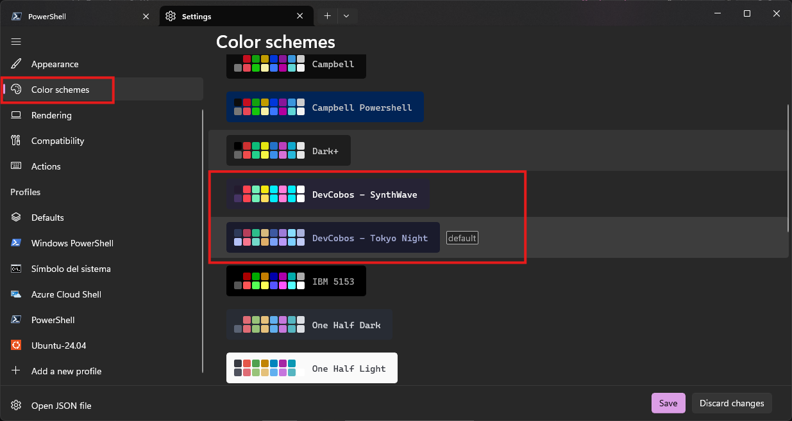
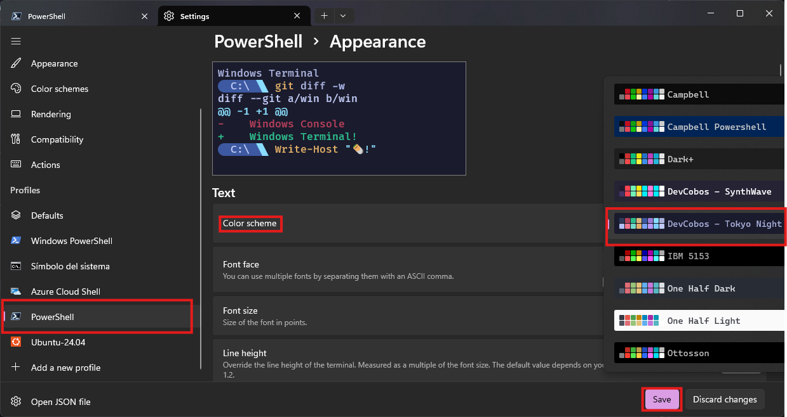

# Windows Terminal Custom Themes 🌙🌆

This project provides a fully customized Windows Terminal setup featuring Tokyo Night theme for PowerShell and SynthWave theme for Ubuntu WSL, along with personalized configurations for a seamless and visually appealing command-line experience.




## Table of Contents

- [Initial Setup](#initial-setup)
- [Installation Color Schemes](#installation-color-schemes)
- [Install Starship - PowerShell (Tokyo Night)](#install-starship---powershell-tokyo-night)
- [Install Starship - Ubuntu WSL (SynthWave)](#install-starship---ubuntu-wsl-synthwave)
  - [Automated install with DevCobos-setup (recommended)](#automated-install-with-devcobos-setup-recommended)
  - [Manual install](#manual-install)

## Initial Setup

1. **Install Windows Terminal**  
   Download and install **Windows Terminal** from the Microsoft Store:  
    [Windows Terminal - Microsoft Store](https://apps.microsoft.com/detail/9N0DX20HK701?hl=en-us&gl=ES&ocid=pdpshare)
2. **Install PowerShell**  
   Download and install the latest version of **PowerShell** from the Microsoft Store:  
    [PowerShell - Microsoft Store](https://apps.microsoft.com/detail/9MZ1SNWT0N5D?hl=en-us&gl=ES&ocid=pdpshare)
3. **Set Windows Terminal as default**

   1. Open **Windows Terminal**.
   2. Go to **Settings**.
   3. Set **Windows Terminal** and **PowerShell** as the default options on startup.
   4. Save the changes.

   

## Installation Color Schemes

This will install both **DevCobos - Tokyo Night** and **DevCobos - SynthWave** color schemes.

1. Download this repository.
2. Navigate to the `Windows Terminal Theme` folder.
3. Run the `install.ps1` script.
4. Once installed, restart your terminal.
5. Open the settings and go to **Color Schemes**. You will see both themes available.
   

### Configure PowerShell Profile (Tokyo Night)

1. Go to `Settings → Profiles → PowerShell`.
2. In the **Appearance** tab, select **DevCobos - Tokyo Night** as the color scheme.
3. Save the changes.
   

### Configure Ubuntu WSL Profile (SynthWave)

1. Go to `Settings → Profiles → Ubuntu` (or your WSL distribution).
2. In the **Appearance** tab, select **DevCobos - SynthWave** as the color scheme.
3. Save the changes.

### Change Tab Row (Optional)

1. Open the settings and go to **Appearance**.
2. Locate the option **Use Acrylic Material in the tab row**.
3. Save the changes.
   

### Install a compatible font (required to use Starship)

You need a Nerd Font installed and enabled in your terminal to display icons and special symbols.

1. Download a `FiraCode Nerd Font` font from: [Nerd Fonts - Font Downloads](https://www.nerdfonts.com/font-downloads)
2. Install the font and open the terminal.
3. Go to `Settings → Profiles → Defaults → Appearance`.
4. Select the font **FiraCode Nerd Font Mono** and set the font weight to **Medium**.
5. Save the changes.
   

## Install Starship - PowerShell (Tokyo Night)

[Official Documentation](https://starship.rs/guide/)

### Using winget to install

```powershell
winget install --id Starship.Starship
```

### Configure PowerShell to use Starship with Tokyo Night theme

1. Download this repository.
2. Navigate to the `Starship/PowerShell` folder.
3. Run the `install.ps1` script.
   - ⚠️ Important: The script will check your existing PowerShell profile ($PROFILE).
   - If Starship is already configured, it will ask if you want to overwrite.
   - If not configured, it will append the Starship initialization to your existing profile.
   - A backup of your profile will be created automatically before any changes.
 
4. Once installed, restart your terminal.
   

## Install Starship - Ubuntu WSL (SynthWave)

[Official Documentation](https://starship.rs/guide/)

### Automated install with DevCobos-setup (recommended)

The [DevCobos-setup](https://github.com/devcobos/DevCobos-setup) project provides an interactive installer that configures **Zsh + Starship** with the SynthWave theme, plugins (autosuggestions, syntax highlighting), and useful aliases — all in one step.

1. Clone and run the installer:
```bash
git clone https://github.com/devcobos/DevCobos-setup.git ~/DevCobos-setup
sudo -v && ~/DevCobos-setup/install.sh
```
2. In the main menu, choose **Select tools** to pick only what you need.
3. Use the arrow keys to navigate the list and press `Space` to select **Zsh + Starship**.
4. Press `Enter` to confirm and start the installation.

The script will automatically:
- Install **Zsh** and set it as your default shell.
- Install **Starship** and deploy the SynthWave prompt configuration.
- Set up **zsh-autosuggestions** and **zsh-syntax-highlighting** plugins.
- Configure **eza** aliases for a modern `ls` experience.

> After installation, close and reopen your terminal for the changes to take effect.

### Manual install

If you prefer to set everything up manually, follow the steps below.

#### Using curl to install Starship

```bash
curl -sS https://starship.rs/install.sh | sh
```

#### Configure your shell

1. Open the Ubuntu/WSL terminal.
2. Edit `~/.bashrc` with your preferred editor (example with `nano`):
```bash
nano ~/.bashrc
```
3. Go to the end of the file and add this line:
```bash
eval "$(starship init bash)"
```
4. Save and exit `nano`:
   - Press `Ctrl + O` → Enter (to save)
   - Press `Ctrl + X` (to exit)
5. Reload the Bash configuration without closing the terminal:
```bash
source ~/.bashrc
```

#### Configure the SynthWave theme

1. Create the Starship configuration folder if it doesn't exist and open the config file:
```bash
mkdir -p ~/.config && nano ~/.config/starship.toml
```
2. Copy the entire content from `Starship/Ubuntu-WSL/synthwave-custom.toml` into this file.
3. Save and exit `nano`:
   - Press `Ctrl + O` → Enter (to save)
   - Press `Ctrl + X` (to exit)
4. Your prompt should now display the SynthWave theme!
